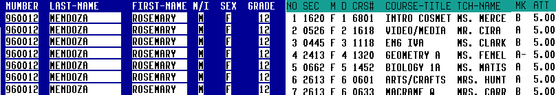

```{r setup, include=FALSE}
knitr::opts_chunk$set(echo = T, message = FALSE, warning = FALSE)
```


```{r echo=FALSE}

date <- Sys.Date()
dta  <-data.frame(  c(1:4),
   LETTERS[1:4], 
   c(T,F,T,T),
   seq(from=(date-3),to=date,by=1),
   c(1.5,2.3,(2/3),5)  , stringsAsFactors=FALSE)
colnames(dta) <- c("int.var","char.var","log.var","date.var","num.var")
rownames(dta) <- paste0("unit", c(1:4) )

```


## Quickie Sermon on Data Quality 

Prevention Cost: 

  - Verifying the quality a record costs the business $1. 

Correction Cost: 

  - Cleansing and deduplicating a record costs the business $10. 

Failure Cost: 

  - Working with a record that’s never cleansed costs $100. 

[1-10-100 Rule of Data Quality](http://www.smartdatacollective.com/martindoyle/222401/why-data-should-be-business-asset-1-10-100-rule)


- # Read [Tidy Data article](http://cran.r-project.org/web/packages/tidyr/vignettes/tidy-data.html)


> Happy families are all alike; every unhappy family is unhappy in its own way

> -Leo Tolstoy, as quoted by Hadley


## Tidy Data Sets

1. Each variable forms a column
2. Each observation forms a row
3. Each data set contains rows w/ only one unit of analysis

as defined by Hadley Wickham's [Tidy Data](vita.had.co.nz/papers/tidy-data.pdf)


## **Ex. of Units of Analysis**

  - students within classes
  - classes within degree programs
  - degree programs within departments
  - departments within schools
  - schools within colleges (undergrad vs. grad. vs extension)
  - colleges within universities


## Tidy Data Types

### For each unit, 

- a text variable should be stored as text, 
- a numeric variable as a number, 
- and so on, 

### All consistent across the data set

```{r}
str(dta)

```


## Untidy Data

  1. Column names represent data values instead of variable names
  2. A single column contains data on multiple variables instead of a single variable
  3. Variables are contained in both rows and columns instead of just columns
  4. A single table contains more than one observational unit
  5. Data about an observational unit is spread across multiple data sets


### Notice: no.4 & 5 assume that you can 

  - blend/merge data sets by adding new cols
  - but cannot append new rows of differing units of analysis


## Transcripts: Untidy data


## Transcript Records: Tidy Data


## Transcript Records: Tidy Data


Universities have lots of Transactional Records.

Each row is one action taken by the same student over time.


## Transcript Records: Tidy 
<br>


Universities have lots of Transactional Records.

Each row is one action taken by the same student over time.


## Tidy Process
<br>

1. Take `raw` data, **correct it**
2. Take `corrected` data, **make it consistent**
3. Take `consistent` data, **transform it** 
4. Take `transformed` data, **merge it**
4. Take `merged` data, **analyze it**


## Stastical Analysis Value Chain


[de Jonge and van der Loo](http://cran.r-project.org/doc/contrib/de_Jonge-van_der_Loo-Introduction_to_data_cleaning_with_R.pdf)


## Tidy Recipe
<br>

1. Raw data file
2. R script contain all tidying procedures
3. Tidy data file
4. A codebook describing variables and their values
    - most university data files do not have these codebooks


### Major public services

- sharing data files across silos
- creating and sharing codebooks 


## Wrangling = Explore + Tame


### To explore, we use

- table
- plot


### To tame, we use

- tidyr
- dplyr


## tidyr


<q> In data processing, data are often represented by a combination of items (objects organized in rows), and multiple variables (organized in columns).</q>

-[Wikipedia on Data](http://en.wikipedia.org/wiki/Variable_(research))


## Tidy data 


**Check if**

- Each column is a variable.
- Each row is an observation.


**Definitions**

1. *Variable*: a characteric or attribute (height, temperature, distance) of an object or item
2. *Observation*: one instance/example of an object (persons, things, places, activity)


### **SO**

- Columns should have same attribute
- Rows should be for same item/observation


## Tidyr's verb compliments

**reshape** 

2. gather
4. spread 

<br>
**create/join columns**

3. separate
5. unite 

<br>
**extract information**

1. extract
2. extract_numeric


## Reshaping Data
```{r eval=FALSE, echo=T}
install.packages("tidyr")  # make sure to download package
```

```{r echo=T}
library(tidyr)      # remember to attach tidyr
library(dplyr)      # tidyr and dplyr often woven together
```
```{r echo=T}
str(gather)         # basic syntax of gather
str(spread)         # basic syntax of spread
```


## `gather()`

<q>takes multiple columns, and gathers them into key-value pairs: it makes “wide” data longer.</q>  

Other names for `gather()` include 

- melt (reshape2, pandas)
- pivot (spreadsheets) 
- fold (databases)

--[rstudio blog](http://blog.rstudio.org/2014/07/22/introducing-tidyr/)


## Ex.: gather()

We have data frame w/ 4 students who each received counseling services from 

- academic affairs (acad_aff)
- student affairs (stud_aff). 

**Under each service**, we have its reported helpfulness score: 1-10.

```{r echo=FALSE}
did_help <- data_frame(
  students = c("Mick", "Celeste", "Benton", "Lisa"),
  acad_aff = c(3, 9, 6, 7),
  stud_aff = c(4, 7, 8, 4)     # don't have to use stringsAsFalse anymore
)
```
```{r}
did_help
```

- How is this data not tidy? How would you fix it?


## Ex.: gather(), why untidy?
```{r}
str(did_help)   # for starters, check data frame properties
```
### Operative phrase = "Under each service"

We have the same attribute in two separate variables for same person

-  col for acad helpfulness scores 
-  col for stud helpfulness scores


## Ex.: gather(), going tall

**SHOULD BE**: Gather scores by service

- vars for services  and for scores

```{r}
# model : gather(data, col_names_as_key, col_vals_as_values, columns_to_gather)
gather(did_help,                # data to use
       service,                 # var name for service key
       helpful_score,           # var name for scores values
       acad_aff:stud_aff)       # columns to gather
```


## Ex: `spread()`

We have a data.frame containing students' GPA, Rank, & Major:

```{r echo=FALSE}
stud.file  <- data_frame(
  stud.no = c(rep("181012",3),rep("140763",3),rep("143763",3)),
  info.type = rep(c("GPA","Rank", "Major"),3),
  info.value = c(3.22,144,"Chemistry",
              3.78,98, "PoliSci",
              3.48,88, "PoliSci")
  )
```
```{r}
stud.file
```
### Take 30 sec
- How is this data not tidy? How would you tidy it?


## Ex: `spread()`, why untidy?

```{r}
str(stud.file)    # for starters, check data frame properties
```
1. Everything is a character
2. info.value is not a variable. We have three different class types
  - GPA = numeric
  - Rank = integer
  - Major = factor
3. columns do not have common data type


## Ex: `spread()`, going wide

```{r}
# model : spread(data, key, value)
s2  <- spread(stud.file, info.type, info.value)   # go wide
s2                                                # forgot stringsAsFactors=F
str(s2)
```
```{r, echo=FALSE}
s3 <- s2
```


## coerce to correct class type
```{r}
s2$GPA         <- as.numeric(s2$GPA)       # set GPA as numeric
s2[,3]         <- factor(    s2$Major)     # set Major as factor
s2[ , "Rank"]  <- as.integer(s2$Rank)      # set Rank as integer
str(s2) 
s2
```

## Now can do it in one step
```{r}
spread(stud.file, info.type, info.value, convert=TRUE)
```


## Ex: unite, col names w/ compound information
```{r, echo=FALSE}

set.seed(1)
enroll = 15:60
yr_enroll <- data_frame(
  year     = 1990:2010,
  engl.101 = sample(round(enroll/2,0), 21),
  engl.102 = sample(rev(enroll),21),
  math.101 = sample(enroll,21),
  math.102 = sample(rev(enroll),21),
  educ.101 = sample(lag(enroll), 21),
  educ.102 = sample(round(enroll/2,0), 21))

```
```{r}
yr_enroll
```


## Task: tidy yr_enrollments 

We need to gather the data into columns for

- dept
- class level
- enrollments

```{r}
yr_long_enroll <- gather(yr_enroll,                   # data_frame
                         dept_level, enrollments,     # key, value
                         -year)                       # var not to gather
yr_long_enroll
```


## separate multiple values within single column


### break at non-alphanumeric, default 

```{r}

yr <- separate(yr_long_enroll,    
           dept_level,        
           c("dept","level")
           )                           
yr
```


### break at character position

```{r}
long_enroll <- separate(yr_long_enroll,    
             dept_level,        
             c("dept","level"),  
      4)  # break after 4 character            
long_enroll  
```


## unite(), create key for spread()

- Step 1: unite key by joining 2 cols
```{r}
yr <- unite(yr, dept_level, 
            c(dept, level)) 
yr
```

## unite(), create key for spread()
- Step 2: spread data using key:value pairs
```{r}
yr_wide <- spread(yr, dept_level, 
                  enrollments ) 
yr_wide
```


## extract_numeric

```{r}
income <- data_frame( person = 1:5, 
                      amount = c("2000 bucks", "$1500", "250.58", 
                               "5,000", "about 300 dollars")     )
round(extract_numeric(income$amount), 0)         # pulls out the numerics
```

## extract for regex


```{r}
df <- data.frame(x = c(NA, "a-b", "a-d", "b-c", "d-e"))
df %>% extract(x, c("A", "B"), "([[:alnum:]]+)-([[:alnum:]]+)") 
df %>% extract(x, c("A", "B"), "([a-d]+)-([a-d]+)")
```


<style>
table {
  border: none;
  width: 100%;
  border-collapse: collapse;
  font-size: 45px;
  line-height: 50px;
  font-family: 'Ubuntu';'Trebuchet MS';
  font-weight: bolder;
  color: blue;
}

table tr:nth-child(2n-1) {
/*  background: #E8F2FF; */
  background: #FFFFFF;
}
</style>

<!-- Center image on slide -->
<script src="http://ajax.aspnetcdn.com/ajax/jQuery/jquery-1.7.min.js"></script>
<script type='text/javascript'>
$(function() {
    $("p:has(img)").addClass('centered');
});
</script>

<!-- Limit image width and height -->

<style>
img {
    max-height: 560px;
    max-width: 964px;
}
</style>


